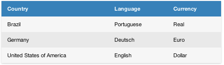

#Generate HTML Tables
Generate a beautiful HTML tables to show any data.
* **Generated CSSs is inline**, to be compatible with the major email clients.
* The cells of the HTML Table **can also contains HTML** code.
* The first row of the matrix represents the header of the HTML Table.


##How to use
Create a matrix representing your data. As said before, the matrix also can have HTML as content.
Here's an example:

```java
class Main{
    public static void main(String[] args) {
        String[][] matrix = new String[4][3];
        matrix[0][0] = "Country";
        matrix[0][1] = "Language";
        matrix[0][2] = "Currency";

        matrix[1][0] = "Brazil";
        matrix[1][1] = "Portuguese";
        matrix[1][2] = "Real";

        matrix[2][0] = "Germany";
        matrix[2][1] = "Deutsch";
        matrix[2][2] = "Euro";

        matrix[3][0] = "United States of America";
        matrix[3][1] = "English";
        matrix[3][2] = "Dollar";

        String html = new TableGeneratorImpl().generateHtmlTable(matrix).toString();
        
        System.out.println(html);
    }
}
```
###Result

